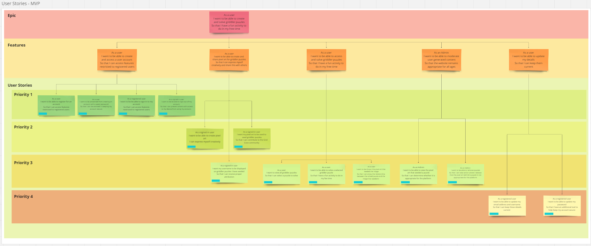
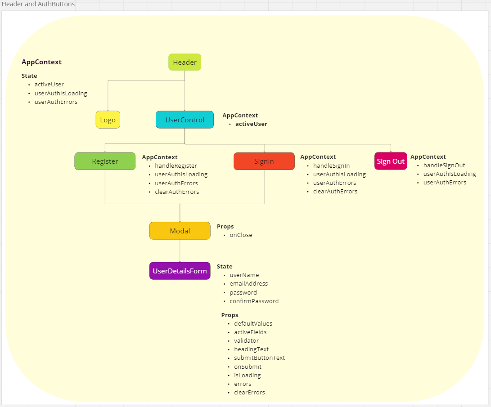

# READ ME

A link to the deployed application may be found below. Please note that the backend is hosted using a free service and can take a minute to get going after a period of inactivity:

[Deployed application](https://grid-cove.vercel.app)

## Proposal Overview

Grid Cove is an application that allows users to create and solve griddler, aka nonogram, puzzles. These are simple logic puzzles which involve deducing which cells must be filled based on the clues by each row/column.

Often, these puzzles are seeded by pixel art which is revealed when the puzzle is solved:

This main problem this application attempts to solve is that of producing a rich library of quality griddler puzzles. It achieves this by providing users with an interface to create pixel art which is then converted automatically into a Griddler puzzle for people to solve.

## Process

### 1. Wire Frames

First, wireframes were produced as part of the proposal process:

It has not been necessary to deviate too far from this original proposal. Some small variances include:

- The builder's name is shown after solve as it is connected to the pixel art
- The puzzles have been grouped by size, as this adds quite a bit of value for very minimal work
- Grid size settings are on a separate screen to keep the build UI tidy.

### 2. User stories

Second, user stories were developed and prioritised to help understand the needs of users.

There were prioritised as follows:

1. Authentication
2. Building Puzzle
3. Accessing, solving and moderating puzzles
4. Updating account details

### Tech Stack

#### Architecture

- React
- Node
- Express
- MongoDB

#### Deployment

- Vercel
- Render
- MongoDB Atlas

### Test Coverage

[Example backend test plan](./gc-back-end/docs/2._test-plans/user-story-6-test-plan.md)

[Example frontend test plan](./gc-front-end/docs/3._tests-by-user-story/user-story-6-tests.md)

After challenge 4, I decided to focus on writing cleaner, more performant React tests. I have seen a significant improvement and this focus on testing has led to strong coverage reports.

While comprehensive, running the entire test suite is slow. This is because I have not yet developed a good sense of what to test. This is something I look forward to learning more about in the future.

### Next Steps

I have lots of ideas for future development. These include:

#### Essential

- Currently, puzzles are not being checked for a single solution. This is a high priority as logic puzzles should be solvable by logic.
- There needs to be stronger moderation of content. Puzzles should not be publicly accessible until approved by an administrator

#### Realistic

- Solves should be recorded so that user's can see which puzzles that have already completed
- Users should be able to rate puzzles by quality and difficulty

#### Aspirational

Puzzle generation in this project is very crude and has varying results. I have been wondering whether AI might be used to predict the quality rating of puzzles and, from this knowledge, generate better puzzles. This is something I am not currently equipped to evaluate let alone implement.
