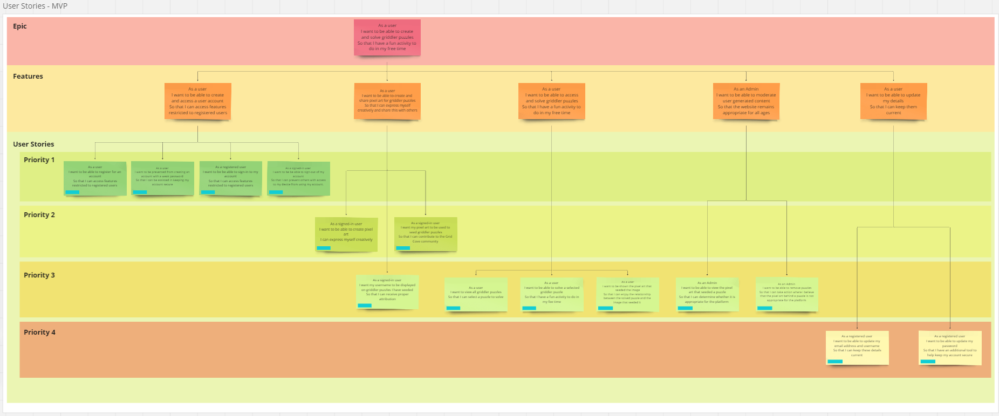

# User Story Planning

## Minimal Viable Product

### User story overview

### User Stories By Feature

#### Feature 1

> - As a user
> - I want to be able to create and access a user account
> - So that I can access features restricted to registered users

##### Feature 1 - User Stories

###### User Story 1

- As a user
- I want to be able to register for an account
- So that I can access features restricted to registered users

###### User Story 2

- As a user
- I want to be prevented from creating an account with a weak password
- So that I can be assisted in keeping my account secure

###### User Story 3

- As a registered user
- I want to be be able to sign-in to my account
- So that I can access features restricted to registered users

###### User Story 4

- As a signed-in user
- I want to be be able to sign-out of my account
- So that I can prevent others with access to my device from using my account

#### Feature 2

> - As a user
> - I want to be able to create and share pixel art for griddler puzzles
> - So that I can express myself creatively and share this with others

##### Feature 2 - User Stories

###### User Story 5

- As a signed-in user
- I want to be able to create pixel art
- I can express myself creatively

###### User Story 6

- As a signed-in user
- I want my pixel art to be used to seed griddler puzzles
- So that I can contribute to the Grid Cove community

###### User Story 7

- As a signed-in user
- I want my username to be displayed on griddler puzzles I have seeded
- So that I can receive proper attribution

#### Feature 3

> - As a user
> - I want to be able to access and solve griddler puzzles
> - So that I have a fun activity to do in my free time

##### Feature 3 - User Stories

###### User Story 8

- As a user
- I want to view all griddler puzzles
- So that I can select a puzzle to solve

###### User Story 9

- As a user
- I want to be able to solve a selected griddler puzzle
- So that I have a fun activity to do in my fee time

###### User Story 10

- As a user
- I want to be shown the pixel art that seeded the image
- So that I can enjoy the relationship between the solved puzzle and the image that seeded it

#### Feature 4

> - As an Admin
> - I want to be able to moderate user generated content
> - So that the website remains appropriate for all ages

##### Feature 4 - User Stories

###### User Story 11

- As an Admin
- I want to be able to view the pixel art that seeded a puzzle
- So that I can determine whether it is appropriate for the platform

###### User Story 12

- As an Admin
- I want to be able to remove puzzles
- So that I can take action where I believe that the pixel art behind a puzzle is not appropriate for the platform

##### Feature 5 - User Stories

###### User Story 13

- As a registered user
- I want to be able to update my email address and username
- So that I can keep these details current

###### User Story 14

- As a registered user
- I want to be able to update my password
- So that I have an additional tool to help keep my account secure
