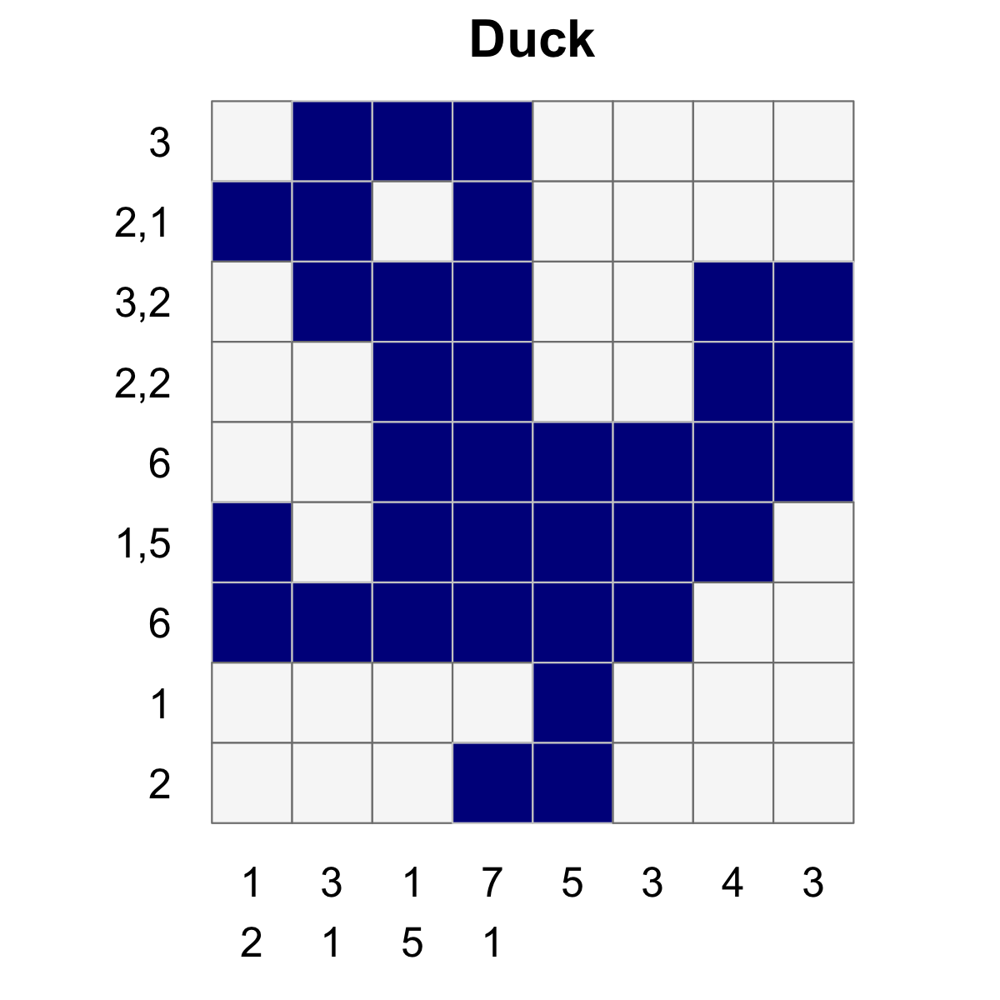
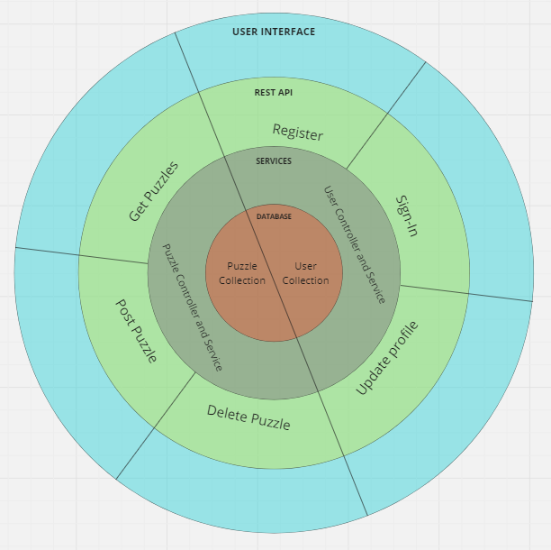

# Grid Cove

## Introduction

Grid Cove is an application that allows users to create and solve griddler, aka nonogram, puzzles. Below is a simple example of a solved puzzle. The number clues indicate a pattern of filled cells. For example, the first row has a clue of 3 and requires 3, contiguous, filled cells in that row.

<!-- markdownlint-disable-next-line -->

Generally, griddler puzzles reveal an image when solved, as in the example above. This presents a challenge when designing these puzzles, as it can be difficult to create an interesting range of pixel art images.

This application will address this challenge by harnessing the creativity of individuals with an interest in pixel art. It will provide a simple interface to create and post pixel art images which will be used to seed griddler puzzles.

Users will be able to access and solve the puzzles created on the platform. Once solved, the pixel art will be revealed.

This application will be of interest to individuals who like pixel art **and/or** solving logic puzzles.

## Features

### MVP

- All users will be able to search and solve puzzles on the platform (READ)
- Users will be able to register for an account (CREATE)
- Registered users will be able to change their username, email and password (UPDATE)
- Registered users will be able to create and post pixel art images which will be used to generate griddler puzzles (CREATE)
- Admin users will be able to remove pixel art images from the database (DELETE)

### Additional Features

- For registered users, a record will be saved for each puzzle solved so they can see and filter out puzzles they have already completed (CREATE AND READ)
- A simple solver will be used to provide an indication of difficulty and to add prefilled cells where necessary to ensure that puzzles have just one solution
- A tutorial for users new to griddler
- Users will be able to filter puzzles by difficulty (READ)
- Admin will be able to mark images as approved and users will only see approved puzzles by default (UPDATE AND READ)
- Users will be able to rate puzzles and sort puzzles by rating (UPDATE AND READ)

## User Interface

The user interface will be very simple and developed with a mobile first approach. The maximum grid size will be 15x15 so that mobile users are not disadvantaged.

The main component here is the grid - This will be used for the build and solve pages, and the logo. It will be made up from cells that can be coloured in to create/solve a puzzle. It will have a prop of doReveal which may be used to flip the cards and reveal a hidden image.

The main libraries I will use are React, vite and tailwind.

Below are some wireframes focussed on the MVP requirements.

## Architecture

The User interface will communicate with a MongoDB database using a Rest API built with Node and express. The database will be hosted by MongoDB Atlas.

The Rest API will have controller and service layers. The controllers will be responsible for the business logic of each route while the services will be responsible for communicating with the database.

## Routing

### Puzzle Routes

#### GET /puzzles

- Payload: none
- Response: [{_id}]

#### GET /puzzles/:id

- Payload: none
- Response: {\_id,size, clues, solution, image}

#### POST /puzzles

- ReqHeaders: cookies[jwt]
- Payload: {size, image}
- Response: {\_id,size, clues, solution, image}

#### DELETE /puzzles/:id

- ReqHeaders: cookies[jwt]
- Payload: none
- Response: none

### Auth Routes

#### POST /auth/register

- Payload: {username, email, password}
- Response: {\_id, username, email}

#### POST /auth/login

- Payload: {email, password}
- Response: {\_id, username, email}
- ResHeaders: setCookies: jwt

#### PATCH /auth/updatePassword

- ReqHeaders: cookies[jwt]
- Payload: {oldPassword, newPassword}
- Response: {\_id, username, email}

### User Routes

#### PATCH /users/:id

- ReqHeaders: cookies[jwt]
- Payload: {newUsername?, newEmail?}
- Response: {\_id, username, email}

## Technologies

### FrontEnd

- React
- Vite
- Tailwind
- Axios
- React-Icons
- Testing-Library
- Vitest

### Backend

- Node
- Express
- Bcrypt
- Cookie Parser
- Express Validator
- JsonWebToken
- Mongoose
- c8
- Chai
- Mocha
- Sinon
- Supertest
- MongoDB

## Deployment

- Frontend: Netlify
- Backend: Render
- Database: MongoDB Atlas
