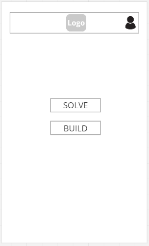
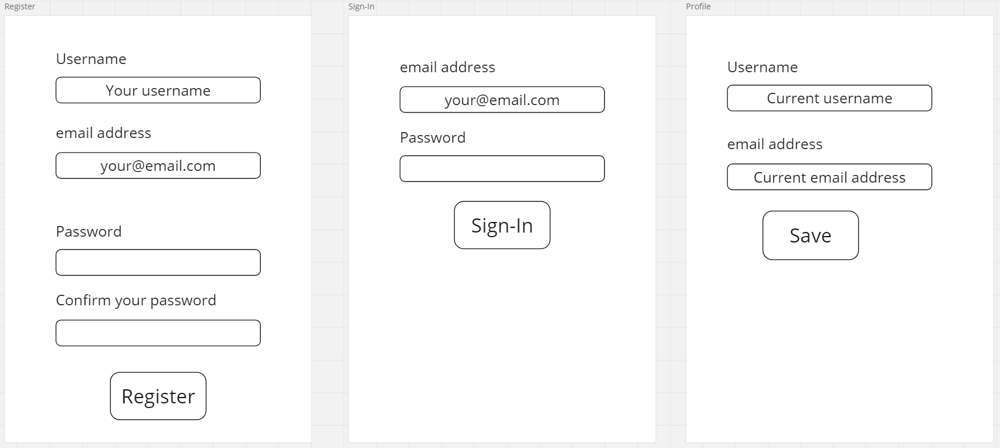
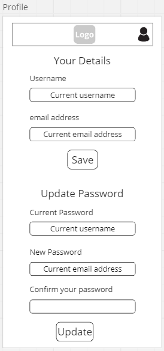
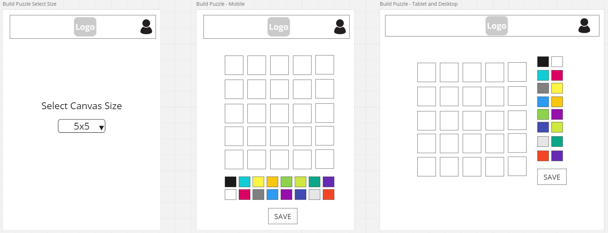
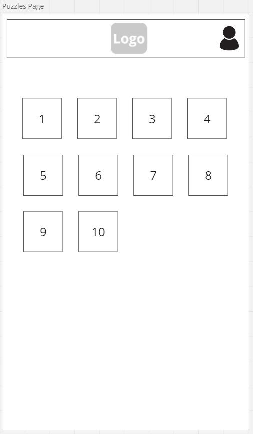
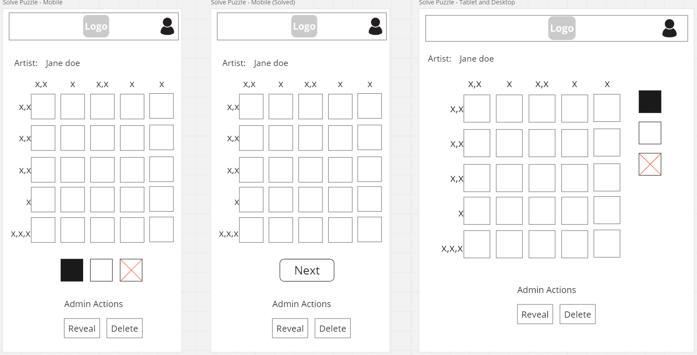

# Wireframes

## Intro

This document contains wireframe planning for the frontend application.

## Home Page

The home page is very simple.

The build option will be disabled when the user is not logged in - There will be a message indicating the need to register or log-in to enable that option. Making this option visible, but disabled, will help new users to understand the broad functionality of the application and what they need to do to access it. From the perspective of the client, this layout may help to drive registrations.

## User Details Form

This is a form component which will be used to register, log-in and update user details (other than password). Making this form reusable benefits the user as it will reduce the overall size of the bundle they need to download. From the perspective of the client, a faster load time for users reduces the chance that they will leave the page before it has loaded.

## Profile Page

The profile page allows users to edit their contact details and update their password. The first section, uses the user details form above. The second section will use a separate form component.

## Build Page

The build page will initially show a dropdown requesting that the user choose a canvas size.

Once the user has selected an option a grid and paint set element will be shown.

For larger screens the grid and controls will be displayed side-by-side.

## Puzzles Page

For the MVP this will be a simple list of puzzles retrieved from the database.

## Solve Page

This page is similar to the build page and I plan to reuse many of the components. As with the build page, the grid and controls will be placed side-by-side on larger screens.

Once a grid has been solved there will be a next button which allows users to quickly access the next puzzle in the list.

Users with an admin role will have additional options to reveal the solution and delete a puzzle. This is to enable some moderation of user created content.

