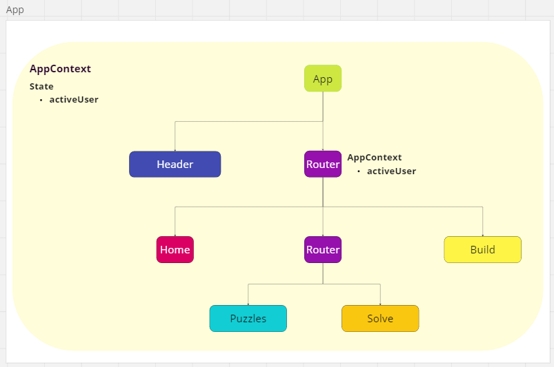
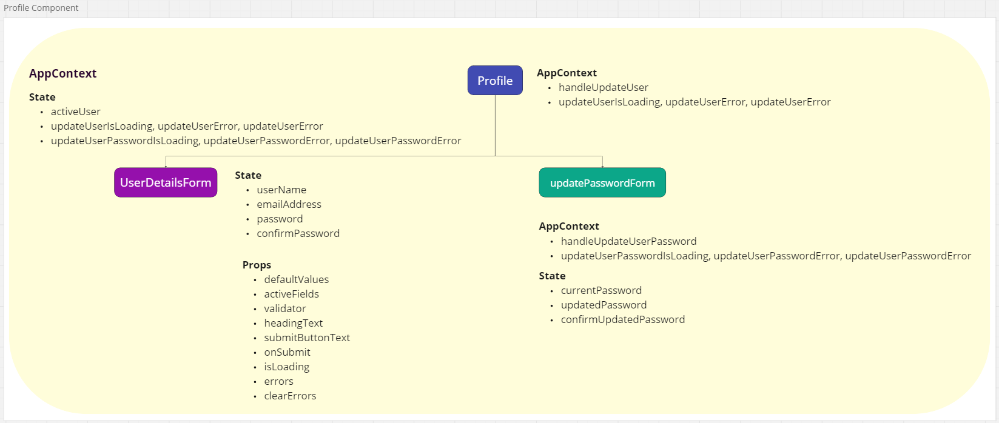
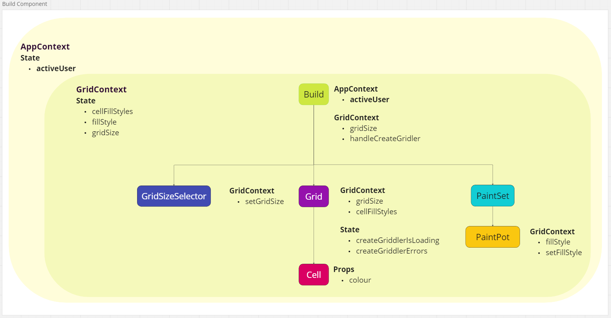
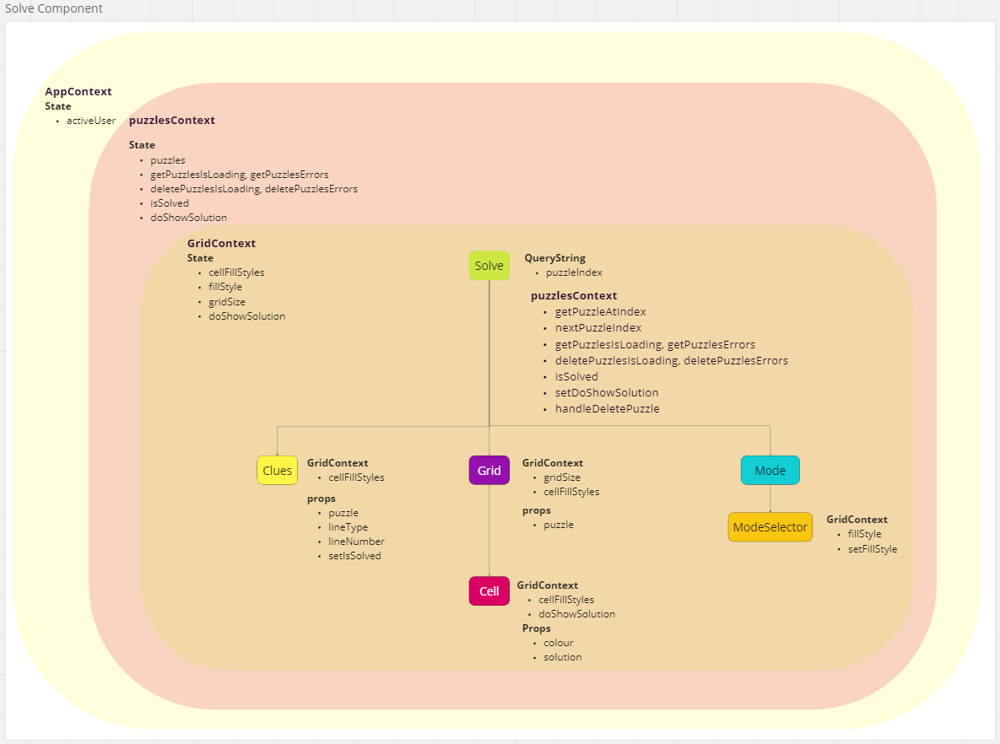
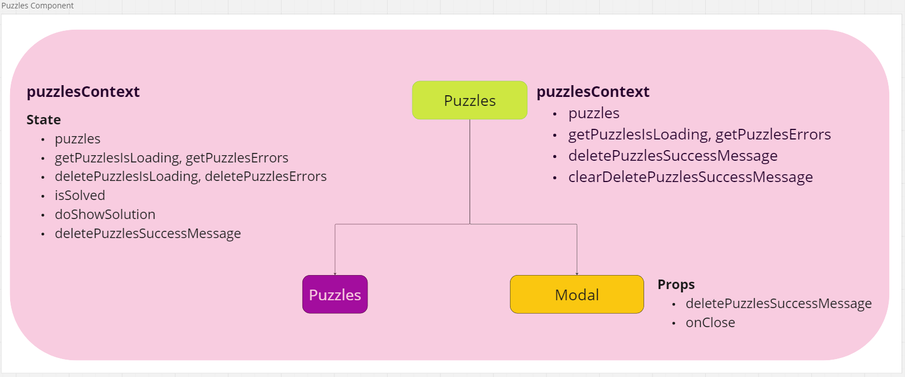

# Naive Component Hierarchies

## Intro

This is a record of component hierarchies designed prior to starting to code. I expect these to change substantially. Note, I did make a few prototype components to help determine the feasibility of my proposal, but I am taking a different approach to state here to try and improve performance.

As far as possible, I want to remove business logic from the components. Accordingly, I will move such logic to custom hooks and contexts. These will expose a simple API for components to access and manipulate data.

## App

App context will be responsible for state relating to the current user.

The only thing of note here is the nested router. This is because Puzzles and Solve will share a provider and I want its state to be persisted when navigating between the two routes.

## Header and Auth Buttons

Sign-out is straight forward. RegisterAndSign in will get the relevant action from the AppContext and pass this down to the user details form.

I am hoping that this will result in a cleaner solution than the approach I took in challenge 4. It may also allow me to easily update the app state if a 401 error is returned from any other services used in the application.

## Profile

This is similar to the above. I have separate status state for updating a user and updating a password. This is so loading spinners and errors can be properly located.

## Build

The state set-up for grid is tentative. I have decided to store cellFillStyles as an array in GridContext. This is because

- Access to the colour of each cell will be needed to generate a puzzle string
- It means I can use just 2 event handlers

I had written a prototype grid component in which each cell held its own colour state. My plan was to access this from above by storing the colour as a data attribute, however:

- I am concerned this is bad practice
- It would require up to 450 event handlers

With this new approach each update will trigger every cell to rerender. This would be so whether or not I use context because state will be stored as an array. Despite this, I expect that this method will be more performant than 450 event handlers.

## Solve

This is similar to the above with the addition of a puzzles context. Because this context may or may not be present, I have made sure not to use it in Grid or Cell.

I want browser history to function correctly here - So, a puzzle index is passed as a query string.

Admin users will be permitted to reveal the solution to, and delete, puzzles. I am planning to navigate back to the puzzles page when the delete button is pressed to avoid an error.

## Puzzles

This component just displays a list of puzzles.

The only thing to note is that state is held for a success message when a puzzle is deleted. This is so that a modal may be shown to inform the user where the operation was successful.

